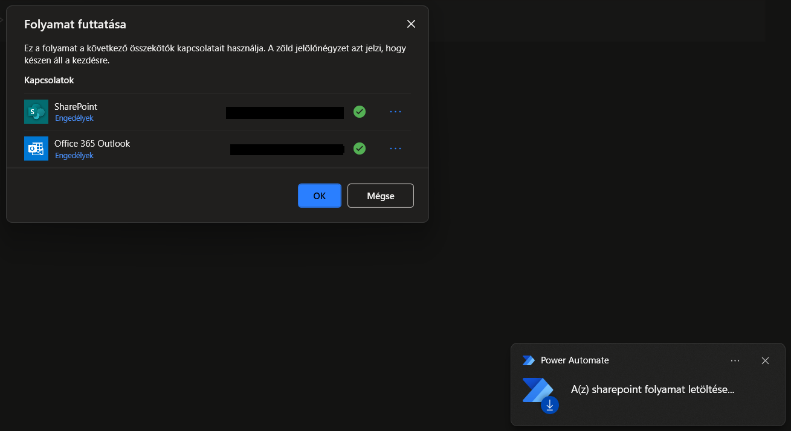
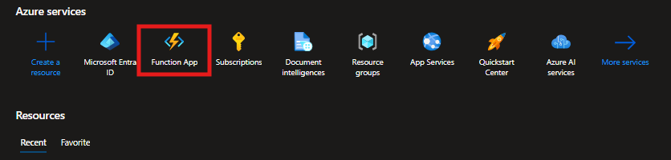

# 📁 SharePoint File Validation System (Desktop & Cloud Solutions)

## 🖥️ Power Automate Desktop + Python

This solution uses Power Automate Desktop to automate the validation of Excel files uploaded to SharePoint. The validation logic is handled by a Python script, and results are used to send feedback via Outlook and archive the processed files.

### 1. File Type Filtering

The flow filters files by extension and only processes those that end with .xlsx
Files with other extensions are skipped.

### 2. Running the Python Script

Valid Excel files are saved to a temporary location. Power Automate executes a Python script using a DOS command. The script reads the file and returns a JSON response describing validation results.

The Python script is structured into the following logical sections:

#### 🧾 Reading file path

```python
import sys
from pathlib import Path

file_path = Path(sys.argv[1])
```

Reads the file path passed by Power Automate as a command-line argument.

#### 📄 Validating required column

```python
import pandas as pd

column_name = "Tételhez írt megjegyzés"
empty_cells = 0
has_empty_cells = None
column_status = None

try:
    df = pd.read_excel(file_path, header=1, engine="openpyxl")

    if column_name in df.columns:
        empty_cells = df[column_name].isna().sum()
        if empty_cells > 0:
            has_empty_cells = f"There are {empty_cells} missing values in the '{column_name}' column."
    else:
        column_status = (
            f"The required column '{column_name}' is missing from the file. "
            "Please ensure that the correct header row is present and that the column name is spelled correctly."
        )
except Exception as e:
    column_status = f"Error reading Excel file or checking column: {str(e)}"
```

Loads the Excel file and checks if the required column exists and whether it contains any missing values.

#### 📅 Checking cell B1

```python
b1_content = None

try:
    df_b1 = pd.read_excel(file_path, header=None, usecols="B", nrows=1, engine="openpyxl")
    b1_value = df_b1.iloc[0, 0] if not df_b1.empty else None

    if pd.isna(b1_value) or b1_value is None:
        b1_content = "The period date is missing in the file. Please enter a valid date in cell B1."
    elif pd.to_datetime(b1_value, errors="coerce") is pd.NaT:
        b1_content = (
            "The period date in cell B1 is not valid. Please use a correct date format "
            "(e.g., 2024-03-20 or 2024.03.20)."
        )
except Exception as e:
    b1_content = f"Error reading B1 cell: {str(e)}"
```

Reads and validates the content of cell B1 to ensure it contains a valid date.

#### 📦 Creating JSON response

```python
import json

response = {
    "fileName": file_path.name,
    "emptyCellCount": int(empty_cells),
    "hasEmptyCells": has_empty_cells,
    "b1Content": b1_content,
    "columnStatus": column_status,
}

print(json.dumps(response))
```

Creates a JSON object summarizing the validation results and prints it to stdout so Power Automate can read and act upon it.

### 3. Processing the JSON Output

The script returns a JSON object with the following keys:
- fileName
- emptyCellCount
- hasEmptyCells
- b1Content
- columnStatus

This data is parsed into individual variables in the Power Automate flow.

### 4. Flow Logic Based on Validation Results

Depending on the validation outcome, different branches of the flow handle email notifications and file archiving:

| Condition                 | Action                    |
|---------------------------|---------------------------|
| `columnStatus` not null   | Send error email          |
| `hasEmptyCells` not null  | Send warning email        |
| `b1Content` not null      | Send date error email     |
| All fields are null       | Send success report email |


All files, regardless of outcome, are moved to an archive folder in SharePoint.

Each email message uses a template that includes the original file name and relevant validation messages.

### 🕒 Automating the Flow with Windows Task Scheduler

You can also run the Power Automate Desktop flow automatically using Windows Task Scheduler, without relying on cloud triggers. This is useful for scenarios where you want the validation to run on a schedule (e.g., every morning at 8:00 AM).

#### 🔧 Setup Instructions

1. Open Task Scheduler
    - Press `Win + R`
    - type `taskschd.msc`
    - press `Enter`.

<br>

2. Create a New Task

<br>

3. Triggers Tab
    - Click New… to create a trigger
    - Set the desired schedule (e.g., Daily at 08:00).
    - Click OK.

<br>

4. Actions Tab
    - Click New….
    - Action: Start a programIn Program/script, enter: `"C:\Program Files (x86)\Power Automate Desktop\dotnet\PAD.Console.Host.exe"`
    - In Add arguments (optional), use the following syntax: `ms-powerautomate:/console/flow/run?environmentid=...`
<br>



### 🔗 Useful Links and References

[Trigger desktop flows (official docs)](https://learn.microsoft.com/en-us/power-automate/desktop-flows/trigger-desktop-flows).

[Manage desktop flow connections (official docs)](https://learn.microsoft.com/en-us/power-automate/desktop-flows/desktop-flow-connections).

[Prerequisites and limitations (official docs)](https://learn.microsoft.com/en-us/power-automate/desktop-flows/requirements).

[Limits of automated, scheduled, and instant flows (official docs)](https://learn.microsoft.com/en-us/power-automate/limits-and-config).

[PAD Python script module not found](https://community.powerplatform.com/forums/thread/details/?threadid=4a5ac813-8085-ef11-ac20-7c1e5214681b).

## ☁️ Power Automate Cloud + Azure Functions + Python

This section describes how to create a fully cloud-based version of the file validation process using Power Automate Cloud, Azure Functions, and Python. This is ideal for scenarios where you want the automation to run independently of any local machine, and fully hosted in Azure.

1. Create a Power Automate Cloud Flowtrigger azure function app with http request
   
    </br>
    
    - Trigger: Use a manual trigger or a SharePoint trigger (e.g., When a file is created in a folder).
    - Add an HTTP action to send the file content and name to an Azure Function via POST request.

    </br>

2. Create an Azure Function App

    </br>

    - [Azure Portal](https://portal.azure.com).
    - [Create your first function in the Azure portal](https://learn.microsoft.com/en-us/azure/azure-functions/functions-create-function-app-portal?pivots=programming-language-csharp)
    
    </br>

    

    </br>

    - [Azure Functions hosting options](https://learn.microsoft.com/en-us/azure/azure-functions/functions-scale)
    - [Azure Functions pricing](https://azure.microsoft.com/en-us/pricing/details/functions/)

    </br>

3. Configure the HTTP Action in Power Automate
    </br>

    - Method: POST
    - URL: Use the function’s endpoint from Azure (visible in the Azure Portal once deployed)
    - Headers: Content-Type: application/json
    - Body:
        ```json
        {
        "fileName": "example.xlsx",
        "fileContent": "<base64 encoded content>"
        }
        ```

    </br>
4. Processing and Response
    </br>
    - The Azure Function will validate the file and return a JSON response.
    - Use conditional logic in Power Automate to parse the response and send emails / update SharePoint / log results, just like in the desktop flow.

### Microsoft Graph & SharePoint Access (Optional)

To access SharePoint files directly from Python (without using Power Automate to upload them), you can use the Microsoft Graph API. This allows secure access to SharePoint, OneDrive, Teams, and more.

Microsoft Graph is the gateway to data and intelligence in Microsoft cloud services like Microsoft Entra and Microsoft 365. 


[Overview of Microsoft Graph](https://learn.microsoft.com/en-us/graph/overview?context=graph%2Fapi%2F1.0&view=graph-rest-1.0)

[Accessing and Downloading SharePoint Files via Python and Microsoft Graph API](https://medium.com/@eric_vaillancourt/using-the-python-sharepointclient-to-access-and-manage-sharepoint-files-9354361b2f9b)

### Authentication with Microsoft Entra ID

Before you can use Graph API, you need to register your app in Microsoft Entra ID:
[Quickstart: Register an application in Microsoft Entra ID](https://learn.microsoft.com/en-us/entra/identity-platform/quickstart-register-app?tabs=certificate%2Cexpose-a-web-api)

In this quickstart, you learn how to register an application in Microsoft Entra ID. This process is essential for establishing a trust relationship between your application and the Microsoft identity platform. By completing this quickstart, you enable identity and access management (IAM) for your app, allowing it to securely interact with Microsoft services and APIs.
